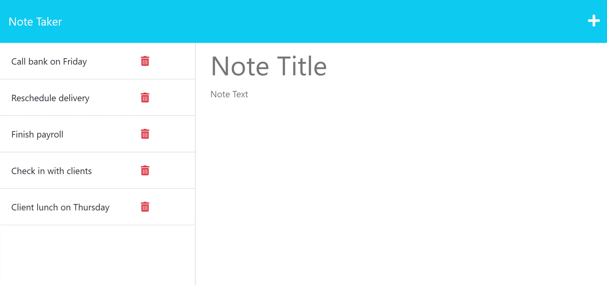

# NoteTaker

## Descriptions

This is a simple app that allows you to write/save notes that will be stored onto an online database.

## Table of Contents

- [Introduction](#introduction)
- [Installation](#installation)
- [Usage](#usage)
- [Contributing](#contributors)
- [License](#license)
- [Acknowledgments](#acknowledgments)

## Installation

n/a

## usage

- [**_Live Web App_**](https://notetakerwiz-c99fdb6b807c.herokuapp.com/notes)
  Enter a title and a note then click the save icon that will appear in the top right hand corner of the webpage. To delete a not you need to click the delect icon next to the note then refresh the page.

## License

https://mit-license.org/

## Contributors

Landon

## Tests

n/a

## Contact me

- [GitHub](https.github.com/KingKonaTheFirst)
- [Email](kingkonathefirst@gmail.com)
